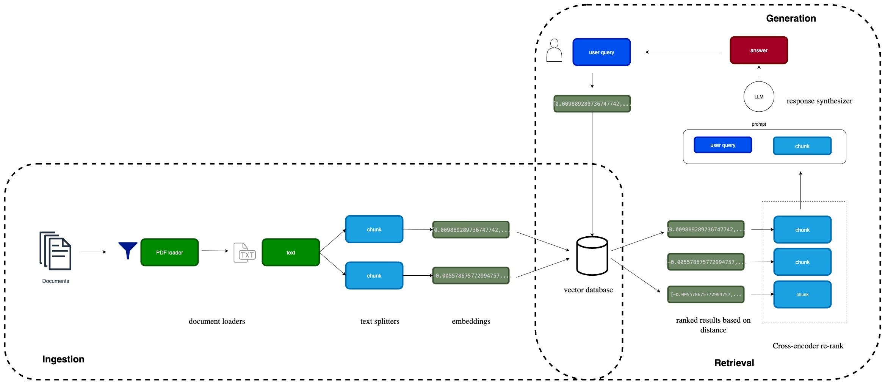

# 📄 Policy Search AI — RAG over Insurance PDFs (LlamaIndex)

A compact, end‑to‑end **Retrieval‑Augmented Generation (RAG)** system that answers questions from **insurance policy PDFs** using **LlamaIndex**.

---

## 🔎 Problem Statement
Long policy PDFs make it hard to locate specifics (eligibility, coverage, exclusions, termination). This project builds a RAG pipeline that extracts, indexes, and retrieves relevant passages and generates **grounded answers with citations** (policy file name · page label).

## 🤝 Why LlamaIndex
- Simple PDF ingestion → **documents → nodes (chunks)**.
- Pluggable **embeddings** and **vector stores (Chroma)**.
- Built‑in **retrievers** and **node_postprocessors** (e.g., **cross‑encoder re‑rank**).
- **Response Synthesizer** controls answer style while keeping citations grounded.
- Scales from a single notebook to an app (Streamlit) with the same APIs.

---

## 🏗️ System Design (High Level)
**Ingestion → Retrieval → Generation**

- **PDF Loader** → text
- **SentenceSplitter** → chunks (with file/page metadata)
- **Embeddings** (SentenceTransformers or OpenAI) → **Chroma** vector DB
- **Retriever** (top‑k) → **Similarity filter** → **Cross‑Encoder re‑rank**
- **Response Synthesizer + LLM** → **Answer + Citations**

## 🖼️ System Design Diagram



---

## 📂 Folder Structure
```
documents/
  policy pdfs
.chroma_db/
PolicySearchAI_LlamaIndex.ipynb
```

---

## ⚙️ Setup
```bash
# Python 3.10+ recommended
# 1. Remove existing virtual environment
rm -rf .venv

# 2. Create new virtual environment  
python -m venv .venv

# 3. Activate and install from requirements.txt
source .venv/bin/activate && pip install -r requirements.txt

pip install -q llama-index-core llama-index-readers-file   llama-index-embeddings-openai llama-index-embeddings-huggingface   llama-index-vector-stores-chroma chromadb   sentence-transformers llama-index-retrievers-bm25   openai tiktoken
```

Set your OpenAI key in .env
```bash
export OPENAI_API_KEY=sk-...
```

---
